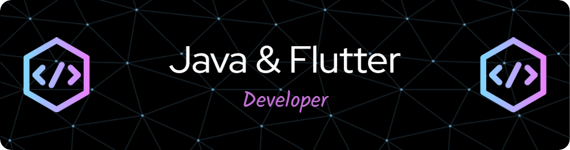

<!--<h1 align="center">Hi 👋, I'm Ranojit Das</h1>-->
<h1 align="center">
    
</h1>

<h3 align="center">A passionate Flutter and Java developer from India</h3>

  

- 🔭 I’m currently working on **Flutter E-Book app ui with audio player**

- 🌱 I’m currently learning **Flutter and cloud computing**

- 💬 Ask me about **Java,JDBC,Dart,Flutter**

- 📫 How to reach me **ranojitdas690@gmail.com**

- 📄 Know about my experiences 

- ⚡ Fun fact **I'm quite introvert**

<h3 align="left">Connect with me:</h3>

  
  

<h3 align="left">Languages and Tools:</h3>

              

 

 

                                                 
 

  

