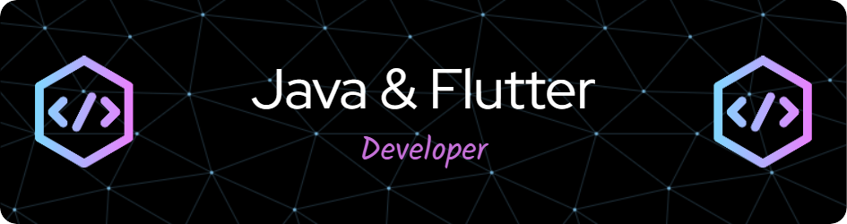
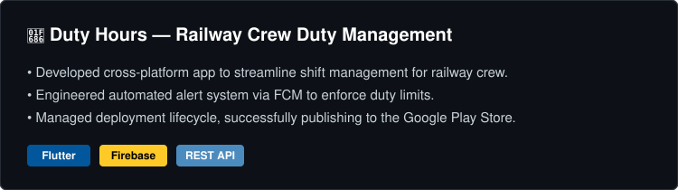
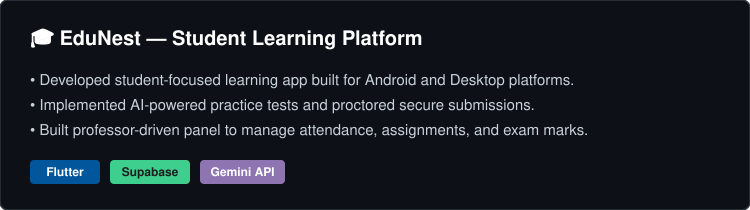
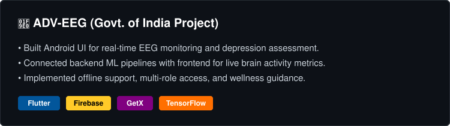

<!--<h1 align="center">Hi 👋, I'm Ranojit Das</h1>-->
<h1 align="center">
    
</h1>

<h3 align="center">
    Computer Engineering Student & Software Developer | Flutter • Kotlin • Java • C++
</h3>

  

- 🔭 I’m currently working on a **Stock Exchange Machine using C++ and Data Structures & Algorithms**

- 💬 Ask me about **C++, Java, Dart, Flutter, Kotlin, Firebase, and Jetpack Compose**

- 📫 How to reach me : **ranojitdas362@gmail.com** , **ce4302023@niamt.ac.in**

- ⚡ Fun fact :  I enjoy finding random UI designs on Figma and turning them into Flutter UI.
<h3 align="left">Connect with me:</h3>

  
  

<h3 align="left">Languages & Technologies:</h3>

<h4 align="left">Languages</h4>

  
  
  
  
  
  
  

<h4 align="left">Development</h4>

  
  
  
  
  
  <strong>REST API</strong>
  
  
  

<h4 align="left">Tools & Concepts</h4>

  
  
  
  
  
   

<h3 align="left">Featured Projects</h3>
 

  

  

  

 

  

&nbsp;

 

                                                 
 

  

