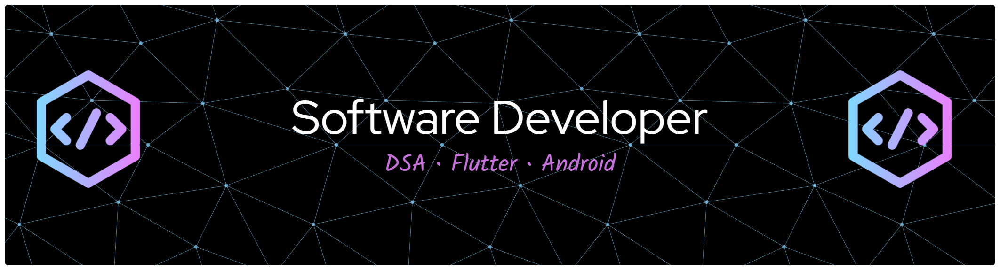

<!--<h1 align="center">Hi 👋, I'm Ranojit Das</h1>-->
<h1 align="center">
    
</h1>

<h3 align="center">
    Computer Engineering Student | Software Developer | Flutter • Android • C++
</h3>

  

- 🔭 I’m currently working on a **Stock Exchange Machine using C++ and Data Structures & Algorithms**

- 💬 Ask me about **C++, Java, Dart, Flutter, Kotlin, Firebase, and Jetpack Compose**

- 📫 How to reach me : **ranojitdas362@gmail.com** , **ce4302023@niamt.ac.in**

- ⚡ Fun fact :  I enjoy finding random UI designs on Figma and turning them into Flutter UI.
<h3 align="left">Connect with me:</h3>

  
  

<h3 align="left">Languages & Technologies:</h3>

<h4 align="left">Languages</h4>

  
  
  
  
  
  
  

<h4 align="left">Development</h4>

  
  
  
  
  
  <strong>REST API</strong>
  
  
  

<h4 align="left">Tools & Concepts</h4>

  
  
  
  
  
   

<h3 align="left">Featured Projects</h3>

<table>
<tr>

<!-- ==================== DUTY HOURS ==================== -->
<td width="50%" valign="top">

<h3>🚉 Duty Hours — Railway Crew Duty Management</h3>

<big>

&nbsp;
Developed a cross-platform app to streamline shift management for railway crew. 

&nbsp;
Engineered automated alert system via FCM to enforce duty limits. 

&nbsp;
Managed deployment lifecycle, successfully publishing to the Google Play Store.

</big>

</td>

<!-- ==================== EDUNEST ==================== -->
<td width="50%" valign="top">

<h3>🎓 EduNest — Student Learning Platform</h3>

<big>

&nbsp;
Developed a student-focused learning app built for Android and Desktop platforms. 

&nbsp;
Implemented AI-powered practice tests and proctored secure submissions. 

&nbsp;
Built a professor-driven panel to manage attendance, assignments, and exam marks.

</big>

</td>

</tr>

<tr>

<!-- ==================== ADV-EEG ==================== -->
<td width="50%" valign="top">

<h3>🧠 ADV-EEG — Government of India Project</h3>

<big>

&nbsp;
Built Android UI for real-time EEG monitoring and depression assessment. 

&nbsp;
Connected backend ML pipelines with frontend for live brain activity metrics. 

&nbsp;
Designed the application for real-time visualization.

</big>

</td>

<!-- ==================== STOCK EXCHANGE MACHINE ==================== -->
<td width="50%" valign="top">

<h3>📈 Stock Exchange Machine</h3>

<big>

🚧&nbsp;
Currently building a stock exchange simulation using C++ and DSA. 

&nbsp;
Focused on efficient order matching and transaction processing.

</big>

</td>

</tr>
</table>
 

  

&nbsp;

 

                                                 
<!-- ==================== EXPERIENCE & ACHIEVEMENTS ==================== -->

<h3 align="left">💼 Experience & Achievements</h3>

 

 

